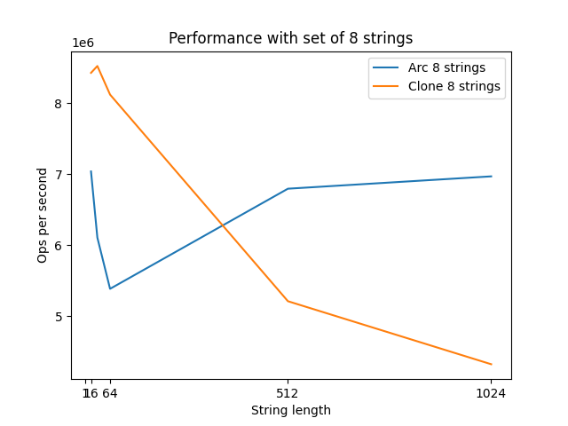

# Arc Microbenchmarking 

## Why

To learn Rust. Discussion that started the curiosity was in the comment section of this video

`https://www.youtube.com/watch?v=A4cKi7PTJSs`

where I'd warned about performance gotchas of atomic reference counting to avoid cloning strings.

Claim: An app that copies a bunch of read-only strings around, will "always" be
faster to use Arc() than to clone strings.

Me: Not convinced: Atomics can be costly on multicore machines.

## How

Goal: Show a scenario where even slow string clones (on the heap with no small
string optimization) can be faster than taking an atomic reference counted
smart pointer. In Rust language that is: Show a benchmark where cloning a
String is faster than cloning an `Arc<String>`.

Basic idea is to cause cache line contention and pipeline stalls in the
`Arc<String>` case that make it run slower than the version that just clones
String.

### App Design

Quick and dirty benchmark; I'm still a Rust noob.

#### Idea 1
One thread per core. 
Each thread does loop:
    Get a set of strings.
    Do computation "operation" based on value of each string. Cause some memory pressure and
      use a little CPU too.
    Measure avg: operation per sec.
*Result*: Clones were faster up to around 64 byte strings. Larger than that, and Arc was faster.

#### Idea 2: Like before but make Clone look better

- Add more threads. Use `num_hardware_threads * 4`
- Use a smaller set of strings (singleton, 8, and 128), to make Arc contention more likely.
- Do less other computation, having the StringSrc.get() calls we're testing in a tighter loop

Result:

